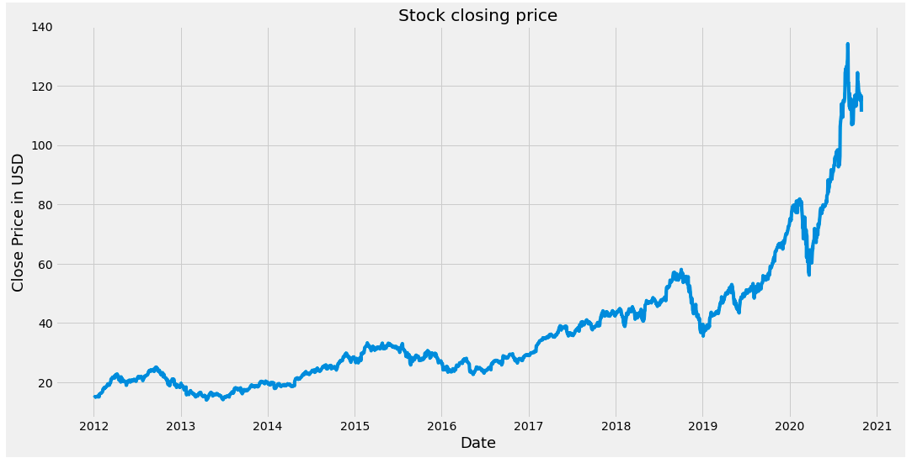
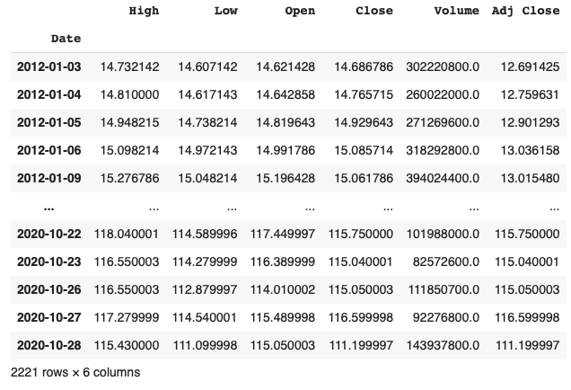
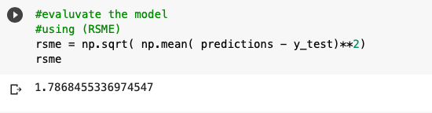
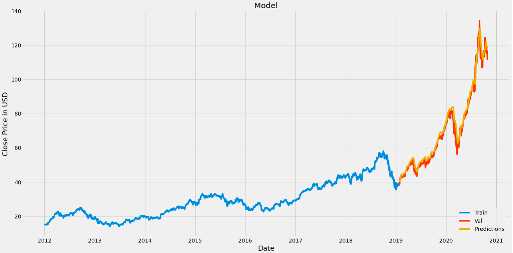

# When to Buy $AAPL
Predicting AAPL's stock price using LSTM

The updated version takes into consideration of AAPL stock split - https://investor.apple.com/faq/default.aspx

## Google Collab Link
https://colab.research.google.com/drive/1G0EKzr_LezsLmpQSxq1RuGE2bbxmyAOB?usp=sharing

## Introduction
I am using a Recurrent neural network called - LSTM to predict the stock price of AAPL (Apple Inc).
I am using LSTM since it has Long term price dependencies.
LSTM's are useful since we can give relevant weights to the important data in the past.
I am using the past 60 days stock price values for the LSTMs.
For the updated version click on google collab link.https://colab.research.google.com/drive/1G0EKzr_LezsLmpQSxq1RuGE2bbxmyAOB?usp=sharing

## Input Data
*Snapshot of data*
The missing dates are Saturdays, Sundays, or Public Holidays

## Model
- Scale the data. 
- Reshape into a 3d (samples, time steps, and features)
- Two dense layers
- Adam optmizer better than gradient boosting ( learns the learning rates itself, on a per-parameter basis)

## Model Prediction

The model's RSME value is **1.7** when the stock prices are in the range of 100+.

*Visualization of the model Predictions*

## Improving the accuracy- Next steps

- Add a Sentiment analysis of twitter feed (previous day's feed)

